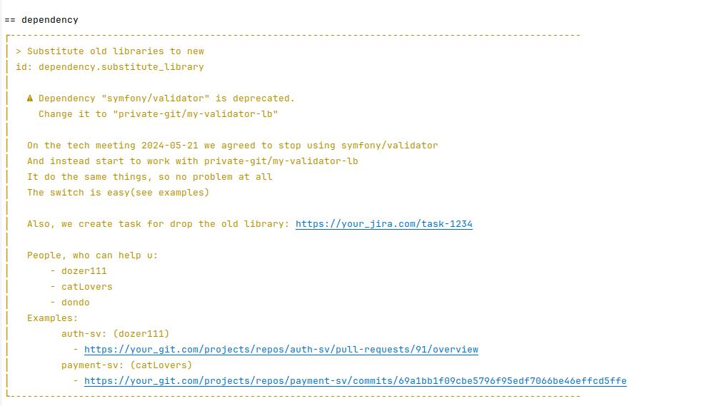
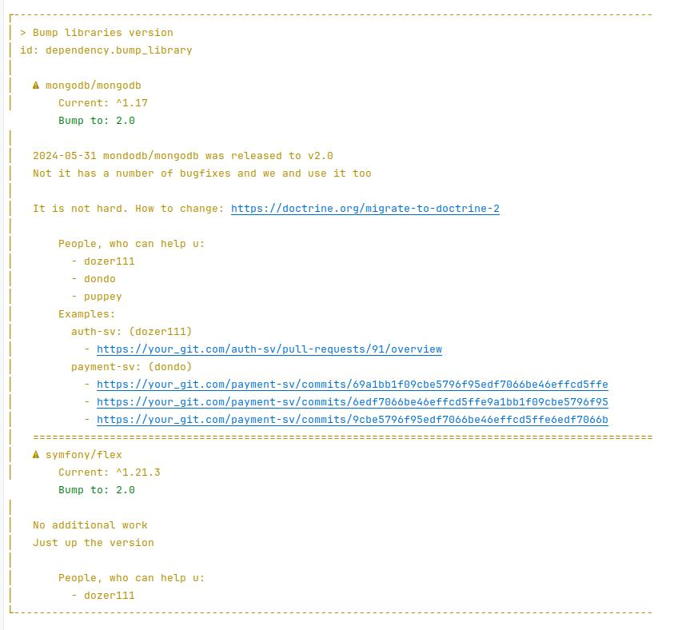

# projectlinter cli app layout

This is a layout of cool cli program "projectlinter"

What does it do? - it is a solution for big companies with a huge code base. Now I`m talking about a hundred or thousand private git repositories

So, you have a huuuuge codebase, and the code become more legacy every day.

The problem with legacy we can divide by 3 parts:

- the programming code become legacy(php code, golang code, js code, ...)
- the configuration files become legacy(Makefile, composer, go.mod, phpunit, ....)
- the dependencies become legacy

The first problem is already solved. There are a lot of libraries(or apps) called linters. You create a linter configuration, setup the rules, and finally this apps change your code(or say you what to change), and the code can be easy actual

But the 2 other problem does not solve. Your actual configuration can change from time to time. And maybe you even have a so called "template" project(from which you start with new app or library). So, your template is the correct version of every project in your git, and you want to always keep all the other project in "correct" state

For example, you have agreed that composer.json must not exist the section "minimum-stability". You change it in template, but how to change it in 2000(for example) other repositories. This act will took too much time.

Is it a problem - yes. Because such small or even big thing would be only more in more in the future. So, you need a helper. Someone, who will know about all that things and tell you - does your project actual or not. And if not - what to change

The `projectlinter` app is that helper

---

## the dependencies become legacy

What about that part?

Your project 100% has a dependencies. And sometimes you need to do a big update.

For example, you have a library "my-private-git/limit-lb". 

### Situation1: You had some problem, and now its fixed

Example: "my-private-git/limit-lb" has a memory leak, and ofk this problem affects your prod. Your apps are crashed sometimes, sounds bad. One day that problem was fixed in version 3.25.

So, you need to go to all the projects and update the version.

### Situation2: You make a change, that is preferable be used in every project

For example, you become to log some part of code, and if the app does not have this update - you would see no logs, and debug become harder

So, you also need to go to all the projects and update the version.

### Situation3: the new version of library is released

"my-private-git/limit-lb" has released 4th version. Sooo amazing.

Now, we wanna to migrate all the projects to new version of library in all the project(and maybe after that remove the v3=>v4 compatibility code)

### Situation4: we need to substitute the library

So, "my-private-git/limit-lb" is cool, and its solve your problem. But what if the internet has better solution? And the solution is popular, maintainable by thousands of people and is much more robust than yours

The idea of stop using own custom code instead of something popular is mature and wright.

And now we need to make this change for all the projects and libraries

---

But the problem is - the update of library is not always easy. For example, because you need to update 1000 projects. So, you want to do it, but the amount of work is soooo big that you say - "fuck this update. If someone need - he would update"

The same problem is for substitute library. It is much more harder then update, because you as a programmer need to read changelogs, understand what to change and how to change, and maybe spend much more time to avoid some secret pitfalls. It is hard, nervous, and not many people like to do it

So, you just ignore it. And I understand this pain. What if I can help you with it? So all the bump or substitute action would be absolutely easy

Is it possible? - with `projectlinter` - yes

You can share all the knowledge about the libraries, and it would be as easy, as newer before
For example:

The dependency updates are really simple now. They are verbose, they have an examples. So, now there is no problem with new version. Just read the examples, read the description and do it)

Not enough info - chat with your colleagues which are "in context". They will help and consult you

As for me - it is the game-change with such problem

---

## This program is working example

This is a working solution right here right now. But it just an example. You need to reconfigure it for yourself

The idea of this app is the same as the other linter - we have an app, which firstly need to configure with rules and ruleSets(a set of rules grouped by some principle(dependency rules, composer rules, phpunit rules, npm rules, ...)) and then we run this app and fix the specified places.

Easy? - easy

As a creator of it I understand that the problem which `projectlinter` solves is big and complex. So, you need some time to investigate the code.

So yes, spend some time to meet and understand it - and your company gain a big boost with obsolescence configuration/dependency problems

## How to projectlinter?

Some time later I will do a number of videos about how the program, how to use and configure it.
Now the app has only some ukrainian description and videos:

- [ukr README](docs/ua/README.md)
- [ukrainian youtube presentation](https://www.youtube.com/playlist?list=PLXofZdsJKYx63R_zVuvi-3s7ndueyM3CB)

## Can I help the project?

Yes you can. This project was conceived as a multilanguage and multiConfiguration(something that is not programming language related but still a configuration) solution

- You can share at least your needs and ideas.(because now it helps you with a little number of possible problems)
- You can write your rules and ruleSets

Let's make your configuration codebase actual again)

