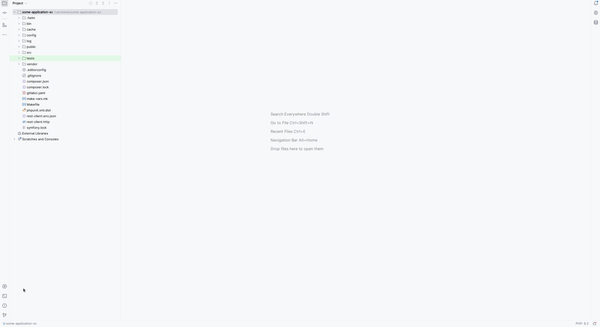

# projectlinter cli app layout

Це шаблон(приклад) того як може виглядати ваш projectlinter

Код розглядається виходячи з таких вводних даних:

- в вашій компанії є кілька відділів, кожен зі своїми програмістами
- кожному відділу треба своя конфігурація projectlinter(або вони майже схожі, але все ж є певні відмінності)
- ви вирішили зберігати конфігурацію в одному місці(наприклад якийсь окремий репозиторій в рамках вашого закритого CVS)
- ви використовуєте кілька мов програмування

---

## призначення директорій

- `bin` - місце де знаходиться актуальний бінарник програми. Може бути корисним якщо перевірки відбуваються на стороні CI
- `cmd` - власне тут описана логіка роботи cli projectlinter
- `linter` - місце де ви власне налаштовуєте правила, які потім будете запускати
- `internal` 
  - `configuration` - місце де знаходиться json-schema по якій будуть налаштовуватися конфігураційний файл project-linter.yaml
  - місце де можуть знаходитись якісь ваші приватні речі(наприклад нові модулі/правила/набори правил, ...)

---

## Як це працює(з точки зору кода)?

Візьмемо такий приклад:

Є компанія `UnitedLtd`, яка операційно поділена на 2 відділи(analytics,core) і розробка ведеться на 2х мовах(PHP,GOlang)

Основну увагу слід зразу звернути на директорію `linter`. Як бачите, в ній є 2 папки - по кожній на відділ.

Щоб не було плутанини, я назвав їх `united-core` та `united-analytics`.

Далі: кожна з директорій відділів має 2 піддиректорії - `go` та `php`.

---

Далі, бачимо що папка з конкретною мовою теж має 3 підпапки:

- application
- library
- shared_source

Що це значить? - UnitedLtd розділяє весь свій код(всі свої репозиторії) на 2 типи: код-програма(наприклад мікросервіси), і код-бібліотека

Це, грубо кажучи - режим роботи. Тобто щоразу при запуску projectlinter має розуміти в якому режимі запускатись - "application"(де один набір правил) або в режимі "library"(де вже інший набір правил)

---

`shared_source` - папка в якій знаходяться спільні для режимів "application" і "library' конфігурації

Що ж може там бути? - як ви бачите - спільними для обох типів проектів є bump та substitute конфігурації

Чому так? - тому що скоріш за все, якщо ви в режимі application(тобто власне на всіх мікросервісах) хочете замінити бібліотеку1 на бібліотеку2, то значить така ж сама заміна потрібна і на рівні режиму "library". Таким чином ми гарантуємо що рано чи пізно ця бібліотека буде повністю замінена у всіх можливих місцях

---

В папці `linter` також є файл `factory.go`

Це налаштування що необхідні для cli команд `projectlinter init`(додати конфігураційний файл `project-linter.yaml` в проект) та `projectlinter run`(запустити projectlinter)

---

## Як це працює(з точки зору користувача)?

Отож, ви вже маєте сконфігуровану програму

Для цього ви

- скачали відповідний шаблон
- замінили назву go модуля на свій
- підналаштували під себе 
  - `linter/factory.go`
  - `internal/configuration`
- доналаштували правила/набори правил
- винесли цей проект в свій приватний git репозиторій

З точки зору користувача все дуже просто. Нам треба знати всього лиш 2 команди:

- `projectlinter init` - ініціалізація лінтера в проекті. Додає конфігураційний файл `project-linter.yaml`
- `projectlinter run` - запуск лінтера в проекті. Програма дивиться на налаштування з `project-linter.yaml` і запускає перевірки для конкретно вашої мови, вашого підрозділа, і вашого режиму роботи(application/library)

Просто? - просто

Поки що ця програма вміє тільки підказувати. Сама код не міняє(

